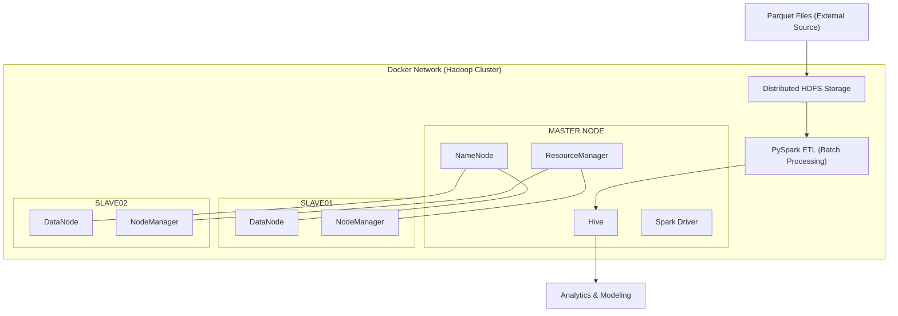

# 🚕 NYC Taxi Big Data Platform 

### Dockerized Hadoop + Spark ETL & Demand Prediction

---

## 📌 Project Overview

This is a **team project (4 members)** focused on building an end-to-end Big Data platform to process and analyze NYC Taxi trip data.

The system simulates a real-world Data Engineering workflow:

> Infrastructure Setup → Data Ingestion → ETL Processing → Analytics → Modeling

The project demonstrates distributed system deployment, batch ETL pipeline design, and analytical modeling using the Hadoop ecosystem.

---

## 👥 Team Information

**Team Size:** 4 members
**My Role:** Data Processing & ETL Engineer

**Main Contributions:**

* Set up Docker-based multi-node Hadoop cluster
* Configured HDFS, YARN, Hive environment
* Built PySpark ETL pipeline
* Performed data cleaning & feature engineering
* Integrated Hive for analytical queries
* Supported demand modeling phase

---

## 🏗 System Architecture



# 🛠 Technology Stack

* Docker
* Hadoop HDFS
* YARN
* Apache Spark (PySpark)
* Hive
* Python
* Jupyter Notebook
* Parquet

---

# 🚀 Infrastructure Setup

## 1. Docker Multi-node Cluster

Containers:

* 1 Master node (NameNode, ResourceManager, Hive, Spark Driver)
* 2 Slave nodes (DataNode, NodeManager)

Cluster configured manually using internal Docker networking and `/etc/hosts`.

---

## 2. HDFS & YARN Initialization

Format HDFS:

```bash
hdfs namenode -format
```

Start services:

```bash
start-dfs.sh
start-yarn.sh
```

Verify:

```bash
jps
hdfs dfsadmin -report
```

---

# 📥 Data Ingestion

NYC Taxi dataset (Parquet format) uploaded into HDFS:

```bash
hdfs dfs -mkdir -p /data/parquet
hdfs dfs -put *.parquet /data/parquet/
```

Data stored in:

```
hdfs:///data/parquet/
```

---

# ⚙️ ETL Pipeline (Batch Processing)

## Step 1 – Read Data from HDFS

```python
from pyspark.sql import SparkSession

spark = SparkSession.builder \
    .appName("NYC_ETL") \
    .enableHiveSupport() \
    .getOrCreate()

df = spark.read.parquet("hdfs:///data/parquet/")
```

---

## Step 2 – Data Cleaning

* Remove invalid passenger_count
* Filter abnormal trip_distance
* Handle missing values

```python
from pyspark.sql.functions import col

clean_df = df.filter(
    (col("passenger_count") > 0) &
    (col("trip_distance") > 0)
)
```

---

## Step 3 – Feature Engineering

* Extract pickup hour
* Aggregate trip counts
* Prepare dataset for analytics & modeling

```python
from pyspark.sql.functions import hour

feature_df = clean_df.withColumn(
    "pickup_hour",
    hour("tpep_pickup_datetime")
)
```

---

# 🗄 Hive Integration

Create external Hive table:

```sql
CREATE EXTERNAL TABLE taxi_data
STORED AS PARQUET
LOCATION 'hdfs:///data/parquet/';
```

Example analytical query:

```sql
SELECT pickup_hour, COUNT(*) AS trip_count
FROM taxi_data
GROUP BY pickup_hour
ORDER BY trip_count DESC;
```

---

# 📊 Exploratory Data Analysis

Key insights:

* Identified peak demand hours (rush hours)
* Determined high-demand pickup zones
* Analyzed trip distance distribution
* Observed passenger count trends

These insights support taxi fleet optimization strategies.

---

# 🤖 Demand Modeling

Objective: Predict taxi demand using time-based features.

Model used:

* Linear Regression (Spark MLlib)

```python
from pyspark.ml.regression import LinearRegression

lr = LinearRegression(featuresCol="features", labelCol="trip_count")
model = lr.fit(training_data)

predictions = model.transform(test_data)
```

Evaluation metrics:

* RMSE
* R²

Model serves as proof-of-concept demand forecasting.

---

# 🔄 End-to-End Workflow

1. Deploy Hadoop cluster via Docker
2. Upload Parquet files to HDFS
3. Run distributed ETL with Spark
4. Store structured data in Hive
5. Perform analytical queries
6. Train baseline demand model

---

# 🎯 What This Project Demonstrates

✔ Distributed infrastructure deployment
✔ Hadoop ecosystem understanding
✔ HDFS data management
✔ Batch ETL pipeline design
✔ Spark distributed processing
✔ Hive-based analytics
✔ Integration of ML with Big Data pipeline

---

# 🚀 Future Improvements

* Convert batch pipeline to streaming (Spark Structured Streaming)
* Add workflow orchestration (Apache Airflow)
* Deploy on cloud environment (AWS EMR / GCP Dataproc)
* Implement CI/CD for data pipeline
